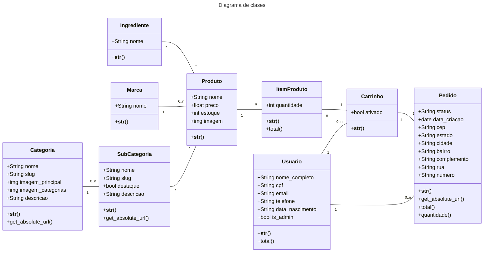

# Ecommerce Django
Este ecommerce foi desenvolvido com o framework django.

## Funcionalidades Principais
- **Manipulação de Produtos**: Adicionar, editar e remover produtos.
- **Carrinho de compras**: Os clientes podem adicionar produtos ao carrinho, atualizar quantidade e remove-los do carrinho.
- **Autenticação de usuários**: cadastro de usuários, sistema de login e logout.
- **Painel administrativo do django**: interface para gerenciar os produtos, pedidos e etc.

## Funcionalidades desejadas mas não inplementadas
- **Login social**: permitir que o usuário cadastre-se ou faça login por exemplo com o google.
- **Pagamentos**: integração com sitemas de pagamentos (exemplos:PayPal, MercadoPago, etc)

## Pré-requisitos
- ### Python
    - Versão 3.10 ou superior

## Instalação

1. Clone o repositório:
    ~~~shell
    git clone https://github.com/pedrodamiaoluz/desafio-altotech.git
    ~~~

2. Crie o ambiente virtual e ative-o:
    ~~~shell
    cd backend
    python3 -m venv venv # ou python -m venv venv para windows
    source venv/bin/activate # ou venv\Scripts\activate para windows
    ~~~

3. Instale as dependências:
    ~~~shell
    pip install -r requirements.txt
    ~~~

4. Execute as migrações do banco de dados:
    ~~~shell
    python3 manage.py migrate # ou python manage.py migrate
    ~~~
    obs: caso o banco de dados já esteja na pasta do projeto, não é necessário executar as migrações.

5. Execute o servidor:
    ~~~shell
    python3 manage.py runserver # ou python manage.py runserver
    ~~~
    Agora Acesse o projeto pelo navegador em http://localhost:8000/.

## Configurações
 * Envio de emails:

    caso debug seja True os emails de reset passowrd e contate nos irão aparecer no terminal.
    ~~~python
    if DEBUG: 
        EMAIL_BACKEND = "django.core.mail.backends.console.EmailBackend" # printa os emails no console
    else:
        EMAIL_BACKEND = "django.core.mail.backends.smtp.EmailBackend" # envia os emails se as variáveis de configuração estiverem preenchidas
    ~~~
    caso queira enviar os emails altere este trecho de código para:

    ~~~python
    EMAIL_BACKEND = "django.core.mail.backends.smtp.EmailBackend" # envia os emails se as variáveis de configuração estiverem preenchidas
    ~~~
    Criar um arquivo .env e adicione as variáveis de ambiente ao arquivo:

    ~~~python
    EMAIL_HOST = "smpt do seu email"
    EMAIL_HOST_USER = "seu endereço de email"
    EMAIL_HOST_PASSWORD = "sua senha do email"
    ~~~

## Diagrama  de classes

